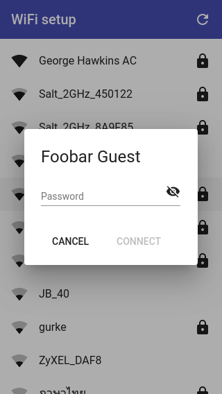

MicroPython WiFi setup
======================



For a quick walkthru of the following steps, with screenshots, click [here](docs/steps.md). For a quick video of the setup process in action, click [here](https://george-hawkins.github.io/micropython-wifi-setup/).

The system works like this:

* Configure your device with a unique ID, to use as its access point name, and physically label the device with the ID.
* On startup, the WiFi setup process checks if it already has credentials for a WiFi network and if so tries to connect to that.
* If it does not have existing credentials or cannot connect, it creates a temporary access point.
* The user looks at the label on the device and selects that access point on their phone.
* The access point is open but behaves like a [captive portal](https://en.wikipedia.org/wiki/Captive_portal), the phone detects this and prompts the user to go to a login webpage.
* Unlike the kind of login pages used by public WiFi services, this one presents the user with a list of WiFi networks that the device can see.
* The user selects the WiFi network to which they want to connect the device and are then prompted for the password for that network.
* Once the device has successfully connected to the network, the user is presented with the device's new IP address.
* Then the temporary access point shuts down (and the standard behavior for the phone is to automatically return to the previous network).
* The user can now use the IP address they have to access the device.
* The device stores the network credentials and will use them to reconnect whenever the device is restarted.

Notes:

* the setup process takes a callback that can perform additional steps on connecting to the network and can return something other than an IP address, e.g. an MQTT topic name.
* when connecting to your WiFi network, the code now also uses the unique ID, that you give your device, as its `dhcp_hostname`. MicroPython will (in addition to using this name when making the DHCP request) advertise this name using mDNS. This _should_ make it possible to access your device as _unique-name.local_ which is far more convenient than using an IP address and should continue to work even if the underlying IP address changes. However, mDNS support varies by platform (though in general, all modern operating systems support it). A bigger issue is that the underlying ESP-IDF currently has a bug in how it replies to mDNS - I've filed an issue relating to this, see [`NOTES.md`](docs/NOTES.md) for more details.

Using this library
------------------


Each device should be given a unique name. Then you just need to add the following to the start of your `main.py`:


```python
from wifi_setup.wifi_setup import WiFiSetup

ws = WiFiSetup("ding-5cd80b1")
sta = ws.connect_or_setup()
```

Above, I've specified `"ding-5cd80b1"` as the device's unique name (which it will use as the name of the temporary access point that it creates). And calling `ws.connect_or_setup()` will go through the steps outlined up above. Once complete the resulting [`network.WLAN`](https://docs.micropython.org/en/latest/library/network.WLAN.html), corresponding to the connected network, will be assigned to `sta`.

Or you can take a more fine grained approach:

```python
ws = WiFiSetup("ding-5cd80b1")
sta = None
if ws.has_ssid():
    sta = ws.connect()
if not sta:
    sta = ws.setup()
```

Here `ws.has_ssid()` checks if credentials for an SSID already exist, if so just connect with `ws.connect()` (if this fails it returns `None`). If there are no existing credentials or `ws.connect()` fails then call `ws.setup()` to create a temporary access point so that the user can go through the steps up above.

If you don't want your board to automatically go into setup mode, you could e.g. make calling `ws.setup()` conditional on a button being held down during startup.

If you want to you can clear any existing credentials with the static method `WiFiSetup.clear()`.

Note that the intention is that `WiFiSetup` is just used at startup - it's **not** working away continuously and your device will **not** randomly enter setup mode whenever your WiFi becomes unavailable.

Basic setup
-----------

If you haven't already got Python 3 installed on your local system, see my [notes](https://github.com/george-hawkins/snippets/blob/master/install-python.md) on installing it.

And if you're new to MicroPython, see my [notes](https://github.com/george-hawkins/micropython-notes/blob/master/getting-started.md) on getting it installed on your development board.

This library has been tested with the stable version of MicroPython 1.12 for both ESP-IDF 3.x and 4.x on boards with both WROOM and WROVER modules.

To get started, first checkout this project:

    $ git clone git@github.com:george-hawkins/micropython-wifi-setup.git
    $ cd micropython-wifi-setup

Then create a Python venv and install [`rshell`](https://github.com/dhylands/rshell):

    $ python3 -m venv env
    $ source env/bin/activate
    $ pip install --upgrade pip
    $ pip install rshell

Once set up, the `source` step is the only one you need to repeat - you need to use it whenever you open a new terminal session in order to activate the environment. If virtual environments are new to you, see my notes [here](https://github.com/george-hawkins/snippets/blob/master/python-venv.md). For more about `rshell`, see my notes [here](https://github.com/george-hawkins/micropython-notes/blob/master/tools-filesystem-and-repl.md#rshell).

All the snippets below assume you've set the variable `PORT` to point to the serial device corresponding to your board.

On Mac you typically just need to do:

    $ PORT=/dev/cu.SLAB_USBtoUART

And on Linux, it's typically:

    $ PORT=/dev/ttyUSB0

Then start `rshell` to interact with the MicroPython board:

    $ rshell --buffer-size 512 --quiet -p $PORT
    >

Within `rshell` just copy over the library like so to your board:

    > cp -r lib /pyboard

The `lib` directory contains a substantial amount of code so copying it across takes about 130 seconds. A progress meter would be nice but as it is `rshell` sits there silently until copying is complete.

Then to copy over a demo `main.py` and some supporting files:

    > cd demo
    > cp -r main.py www /pyboard

The demo just includes the Python code outlined up above followed by a simple web server that can be accessed, once the board is connected to a network, in order to demonstrate that the whole process worked.

Then enter the REPL and press the reset button on the board (the `EN` button if you're using an Espressif ESP32 DevKitC board):

    > repl
    ...
    INFO:captive_portal:captive portal web server and DNS started on 192.168.4.1

You'll see a lot of boot related lines scroll by and finally, you should see it announce that it's started a captive portal. Then just go to your phone and walk through the phone related steps that are shown with screenshots [here](docs/steps.md). Once connected to your network, your board will serve a single web page (of a cute little ghost).

If you reset the board it will now always try to connect to the network you just configured via your phone. If you want to clear the stored credentials just do:

    > repl
    >>> WiFiSetup.clear()

Idle timeout
------------

By default, when your device has not already been configured with the credentials for a WiFi network, it will wait forever for someone to connect to its captive portal and provide it with appropriate credentials. If you'd like to be able to configure it to instead timeout after a given amount of time, e.g. 5 minutes, you can do that by making the following changes to [`captive_portal.py`](lib/wifi_setup/captive_portal.py).

First pull in the utility functions `exists` and `read_text` below the existing `Scheduler` import:

```
from schedule import Scheduler, CancelJob
from shim import exists, read_text
```

Then add a constant called `_IDLE_TIMEOUT` at the start of the `CaptivePortal` class:

```Python
class CaptivePortal:
    _IDLE_TIMEOUT = "idle-timeout.txt"
```

And finally in the `run()` method, add the following block just _before_ the `while self._alive` loop:

```Python
if exists(self._IDLE_TIMEOUT):
      idle_timeout = int(read_text(self._IDLE_TIMEOUT))
      _logger.info("idle timeout set to %ds", idle_timeout)
  
      def expire():
          _logger.info("idle timeout expired")
          self._alive = False
          return CancelJob
  
      self._schedule.every(idle_timeout).seconds.do(expire)
```

All this does is check if a file called `idle-timeout.txt` exists and, if it does, then it expects it to contain a number that it uses as the timeout value (in seconds).

So to create `idle-timeout.txt`, you can use `rshell` again:

    $ rshell --buffer-size 512 --quiet -p $PORT
    $ cd /pyboard
    $ echo 300 > idle-timeout.txt

Here, we stored the value `300` in `idle-timeout.txt`, so now the `CaptivePortal` loop is scheduled to timeout after 300s, i.e. 5 minutes.

Note: the logic above uses the existing scheduler `self._schedule` to run the `expiry` job every `idle_timeout` seconds - however, the job never runs more than once as it returns `CancelJob` which tells the scheduler not to run the job again.

PyPI and this library
---------------------

I did initially try to make this library available via [PyPI](https://pypi.org/) so that it could be installed using [`upip`](https://docs.micropython.org/en/latest/reference/packages.html#upip-package-manager). This took much longer than it should have due to my insistence on trying to get the process to work using [Python Poetry](https://python-poetry.org/) (see my notes [here](docs/python-poetry.md)). But in the end, the effort was all rather pointless as `upip` has not worked for quite some time on the ESP32 port of MicroPython (due to TLS related issues, see issue [#5543](https://github.com/micropython/micropython/issues/5543)).

Anyway, there something fundamentally odd about installing a library that's meant to set up a WiFi connection using a tool, i.e. `upip`, that requires that your board already has a WiFi connection.

Given that, issue #5543 and Thorsten von Eicken's [comment](https://github.com/micropython/micropython/issues/5543#issuecomment-621341369) that "I have the feeling that long term MP users don't use upip" (I did not use `upip` at any point when creating this project), I decided to give up on publishing this library to PyPI.

Using micropython-wifi-setup in your own project
------------------------------------------------

Let's say you have a project called `my-project`, then I suggest the following approach to using the micropython-wifi-setup library within this project:

    $ ls
    my-project  ...
    $ git clone git@github.com:george-hawkins/micropython-wifi-setup.git
    $ LIB=$PWD/micropython-wifi-setup/lib
    $ cd my-project
    $ ln -s $LIB .
    $ echo lib/ >> .gitignore

You could of course just copy the micropython-wifi-setup `lib` directory into your own project but this means your copy is frozen in time. The approach just outlined means that's it's easy to keep up-to-date with changes and it makes it easier to contribute back any improvements you make to the original project, to the benefit of a wider audience.

Web resources
-------------

The web-related resources found in [`lib/wifi_setup/www`](lib/wifi_setup/www) were created in another project - [material-wifi-setup](https://github.com/george-hawkins/material-wifi-setup).

If you check out that project in the same parent directory as this project and then make changes there, you can rebuild the resources and copy them here like so:

    $ ./update-lib-www

The script `update-lib-www` does some basic sanity checking and ensures that it doesn't stomp on any changes made locally in this project. Note that it compresses some of the resources when copying them here.

### Supported browsers

The provided web interface should work for any version of Chrome, Firefox, Edge or Safari released in the last few years. It may not work for older tablets or phones that have gone out of support and are no longer receiving updates. It is possible to support older browsers but this means significantly increasing the size of the web resource included here - for more details see the "supported browser versions" section [here](https://github.com/george-hawkins/material-wifi-setup#supported-browser-versions).

Captive portals
---------------

This library uses what's termed a captive portal - this depends on being able to respond to all DNS requests. This works fine on phones - it's the same process that's used whenever you connect to public WiFi at a coffee shop or an airport. However, on a laptop or desktop, things may be different. If you've explicitly set your nameserver to something like Google's [public DNS](https://en.wikipedia.org/wiki/Google_Public_DNS) then your computer may never try resolving addresses via the DNS server that's part of this library. In this case, once connected to the temporary access point, you have to explicitly navigate to the IP address we saw in the logging output above, i.e.:

    INFO:captive_portal:captive portal web server and DNS started on 192.168.4.1

A more sophisticated setup would sniff all packets and spot DNS requests, even to external but unreachable services like 8.8.8.8, and spoof a response - however, this requires [promiscuous mode](https://en.wikipedia.org/wiki/Promiscuous_mode) which isn't currently supported in MicroPython.

For more about captive portals see the captive portal notes in [`docs/captive-portal.md`](docs/captive-portal.md).

Reusable parts
--------------

There's a substantial amount of code behind the WiFi setup process. Some of the pieces may be useful in your own project.

The most interesting elements are cut-down versions of [MicroWebSrv2](https://github.com/jczic/MicroWebSrv2), [MicroDNSSrv](https://github.com/jczic/MicroDNSSrv/), [schedule](https://github.com/rguillon/schedule) and [logging](https://github.com/micropython/micropython-lib/blob/master/logging). The web server, i.e. MicroWebSrv2, is the most dramatically reworked of these, though the core request and response classes (and the underlying networking-related classes) remain much as they were.

Most of the changes were undertaken to reduce memory usage and to get everything to work well with an event loop based around `select.poll()` and `select.poll.ipoll(...)` (where services are fed with events - what I call pumping). All threading has been removed from the web server and it can only handle one request at a time. Given the use of polling, it would be possible to support multiple concurrent requests - the reason for not doing this, is to avoid the additional memory required to support send and receive buffers for more than one request at a time.

### The web server

How to reuse the web server:

```python
import select
from slim.slim_server import SlimServer
from slim.fileserver_module import FileserverModule

poller = select.poll()

slim_server = SlimServer(poller)
slim_server.add_module(FileserverModule({"html": "text/html"}))

while True:
    for (s, event) in poller.ipoll(0):
        slim_server.pump(s, event)
    slim_server.pump_expire()
```

Create a `www` directory and add an `index.html` there. For every different file suffix used, you have to add a suffix-to-[MIME type](https://developer.mozilla.org/en-US/docs/Web/HTTP/Basics_of_HTTP/MIME_types/Common_types) mapping. In the snippet above the only mapping provided is from the suffix `html` to MIME type `text/html`.

One feature that I added to the web server is the ability to store your files in compressed form, e.g. `index.html.gz` rather than `index.html`, this allowed me to reduce by almost two-thirds the storage needed for the web resources used by this project. See the compression section [here](docs/request-examples.md#compression) for more details.

Note: if you're looking at the web server code and notice camelCase used in some places and more [PEP 8](https://www.python.org/dev/peps/pep-0008/) compliant snake_case in others, this is deliberate - the original code used camelCase and I used snake_case to make clearer what functions and variables I'd introduced.

### The REST module

The web server functionality is organized into modules - above I used the [`FileserverModule`](lib/slim/fileserver_module.py) for serving static files. There's also a [`WebRouteModule`](https://github.com/george-hawkins/micropython-wifi-setup/blob/master/lib/slim/web_route_module.py) that can be used to provide REST-like behavior:

```python
from slim.web_route_module import WebRouteModule, RegisteredRoute, HttpMethod

def _hello(request):
    request.Response.ReturnOkJSON({"message": "hello"})
 
def _log(request):
    data = request.GetPostedURLEncodedForm()
    message = password = data.get("message", None)
    print(message)
    request.Response.ReturnOk()

slim_server.add_module(WebRouteModule([
    RegisteredRoute(HttpMethod.GET, "/api/hello", _hello),
    RegisteredRoute(HttpMethod.POST, "/api/log", _log)
]))
```

Then you can test this logic like so (replace `$ADDR` with the address of your device):

```
$ curl http://$ADDR/api/hello
{"message": "hello"}
$ curl --data 'message=foobar' http://$ADDR/api/log
```

For more on using `curl` like this with the server, and on how things like how setting the header `Accept: application/json` affects things, see these [notes](docs/request-examples.md).

**Important:** for each request, the modules are called in the order that they're registered using `add_module(...)`, if you use `WebRouteModule` you _must_ register it before `FileserverModule` as currently, the `FileserverModule` will respond to any `GET` request that it cannot resolve with `404 Not Found` without giving another module a chance to handle the request.

Note: the original MicroWebSrv2 logic also supported [route arguments](https://github.com/jczic/MicroWebSrv2/blob/master/docs/index.md#route-args), i.e. you could specify values as part of the path, e.g. it could automatically parse out the `5cd80b1` value from a path like `/fetch/id/5cd80b1`. This behavior isn't supported in this cut-down version, parameters are only parsed out of the [query string](https://en.wikipedia.org/wiki/Query_string), e.g. `/fetch?id=5cd80b1`, or out of form data (as shown in the snippet above).

### The Websocket manager

Unlike all the other functionality included in the `lib` subdirectory, the websocket functionality is not used in the WiFi setup process. It is provided as an extra that can be used to control the device once WiFi is setup.

The [`WsManager`](lib/slim/ws_manager.py) works in combination with the `WebRouteModule` introduced above - you just need to create a `WsManager` instance and then specify its `upgrade_connection` method as the handler for a given route. E.g. below it's associated with the route `/socket`. You can then make a websocket connection to the given route and `WsManager` will handle upgrading the connection.

When creating a `WsManager` instance, you need to specify two functions:

* A `consumer` function that will be passed a function that behaves like [`readinto`](https://docs.python.org/3/library/io.html#io.RawIOBase.readinto). The `consumer` should keep reading until there are no more bytes available and should accumulate those bytes into some kind of result message. If it encounters any exceptions, it should just let these bubble up and the calling `WsManager` instance will close and discard the underlying websocket. If it cannot create a complete message out of the bytes available it needs to hang onto the intermediate result, return `None` and complete the message once more bytes become available.
* A `processor` function that does something useful with the messages generated by the `consumer`.

```python
from slim.ws_manager import WsManager

buffer = memoryview(bytearray(128))

def consumer(readfn):
    message = None
    while True:
        count = readfn(buffer)
        if not count:
            break
        # Else decode the buffer and accumulate it into `message`.
    return message

def processor(message):
    # Do something with the given message.
    print(repr(message))

ws_manager = WsManager(poller, consumer, processor)

slim_server.add_module(WebRouteModule([
    RegisteredRoute(HttpMethod.GET, "/socket", ws_manager.upgrade_connection)
]))

while True:
    for (s, event) in poller.ipoll(0):
        ws_manager.pump_ws_clients(s, event)
```

Note that a websocket is a fairly low-level construct and it's up to you to implement some kind of protocol, on top of the raw-bytes level, that defines what a message is and how they're delimited. For an example of this, see how `WsManager` is used in [`main.py`](https://github.com/george-hawkins/micropython-lighthouse-controls/blob/master/main.py) in my [micropython-lighthouse-controls](https://github.com/george-hawkins/micropython-lighthouse-controls) repo.

You can test out the websocket functionality with a command-line tool like [`websocat`](https://github.com/vi/websocat). E.g. to connect to the above route and send the bytes `abc`:

```
$ websocat ws://$ADDR/socket
abc
```

Replace `$ADDR` with the address of your device.

### DNS

Being able to respond to DNS requests is central to implementing the captive portal used by this library. However once your device is connected to an existing network, it's less obvious what use one could make of a mini-DNS server on a MicroPython board. It is just documented here for completeness.

```python
from micro_dns_srv import MicroDNSSrv

addr = sta.ifconfig()[0]
addrBytes = MicroDNSSrv.ipV4StrToBytes(addr)

def resolve(name):
    print("Resolving", name)
    return addrBytes

dns = MicroDNSSrv(resolve, poller)

while True:
    for (s, event) in poller.ipoll(0):
        dns.pump(s, event)
```

Here `sta` is a `network.WLAN` instance corresponding to your current network connection, we use it to get the device's address and convert it into the byte format used by DNS. We provide a `resolve` function that, given a `name`, returns an address - the simple example function just prints the name and resolves every name to the board's address.

### Scheduler

If you're used to [Node.js](https://nodejs.org/en/about/), you're probably also used to using timers to schedule functions to be called at some point in the future. The [`Scheduler`](https://github.com/george-hawkins/micropython-wifi-setup/blob/master/lib/schedule.py) provides similar functionality:

```python
from schedule import Scheduler, CancelJob

def do_something():
    print("foobar")
    return CancelJob

schedule = Scheduler()
job = schedule.every(5).seconds.do(do_something)

while True:
    schedule.run_pending()
```

Here we've registered a job to execute in 5 seconds time. If the function `do_something` didn't return anything then it would be run every 5 seconds forevermore, returning `CancelJob` cancels the job. The job can also be canceled by calling `schedule.cancel_job(...)` on the `job` object we created.

`schedule.run_pending()` needs to be called regularly - this works well in combination with the event pumping loop seen in the previous examples. However, if used on its own it would probably make sense to combine it with `time.sleep(1)` in the loop shown in the example here.

Note: this cut-down version of `Scheduler` only supports `seconds`.

### Logger

The [`Logger`](lib/logging.py) just provides behavior that mimics that of the standard CPython [logging](https://docs.python.org/3/howto/logging.html) and behaves much as you'd expect:

```python
import logging

_logger = logging.getLogger(__name__)

name = "alpha"
count = 42

_logger.warning("%s is now %d", name, count)
```

This will log something like `WARNING:my_module:alpha is now 42` to standard error. As you can see, the logger uses the classic [printf-style formatting](https://docs.python.org/3/library/stdtypes.html#old-string-formatting) that you typically see used with the `%` operator, e.g. `"%s is %d" % ("alpha", 42)`. However here you don't need the `%` operator and the arguments don't need to be wrapped up as a tuple.

Note: this cut-down version of `Logger` requires that you create `Logger` instances, as shown above, it doesn't support the usage `logging.warning(...)` where a default root logger is used.

Regrets
-------

Back in 2013, I achieved my 15 seconds of internet fame by showing that a third party could easily spy on the Smart Config process used by the TI CC3000 (and, I believe, subsequent chips in that range) and recover the user's WiFi password (see [here](https://electronics.stackexchange.com/a/84965/27099) for more details). So I'm a little ashamed to have produced a library where it's even easier to spy on the process involved. A third party simply has to connect to the open temporary access point created by this library and, using [promiscuous mode](https://en.wikipedia.org/wiki/Promiscuous_mode), watch the unencrypted packets exchanged between the user's phone and the device.

Once configured, the credentials are then stored in an easy to recover format on the board (see the [BTree](http://docs.micropython.org/en/latest/library/btree.html) file there called `credentials`). To do better than this would require more interaction between MicroPython and the underlying system, e.g. some systems provide the ability to store credentials such that only the device's WiFi process can recover the necessary information (without it being easily available to anyone who can physically access the board).

I also regret not having created unit tests as I went along. At the start, I thought this project would be rather more trivial than it turned out. By the end, the absence was very much missed when making changes to the code. In the sister project [material-wifi-setup](https://github.com/george-hawkins/material-wifi-setup), I even actively removed the test related elements included by `ng new` when I created the project.

Notes
-----

See [`docs/NOTES.md`](docs/NOTES.md) for more implementation details.

Licenses and credits
--------------------

The code developed for this project is licensed under the [MIT license](LICENSE).

The web server code is derived from [MicroWebSrv2](https://github.com/jczic/MicroWebSrv2), authored by Jean-Christophe Bos at HC<sup>2</sup> and licensed under the [MIT license](https://github.com/jczic/MicroWebSrv2/blob/master/LICENSE.md).

The DNS server code is derived from [MicroDNSSrv](https://github.com/jczic/MicroDNSSrv/), also authored by Jean-Christophe Bos and licensed under the MIT license.

The schedule code is derived from [schedule](https://github.com/rguillon/schedule), authored by Renaud Guillon and licensed under the [MIT license](https://github.com/rguillon/schedule/blob/master/LICENSE.txt).

The logging package is derived from [micropython-lib/logging](https://github.com/micropython/micropython-lib/blob/master/logging), authored by Paul Sokolovsky (aka Pfalcon) and licensed under the [MIT license](https://github.com/micropython/micropython-lib/blob/master/logging/setup.py) (see `license` key).
