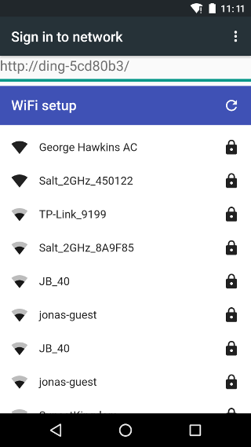

Notes
=====

If you've created your venv before you open the project in PyCharm then it will automatically pickup the Python version from the venv. Otherwise, go toSettings / Project:my-project-name / Project Interpreter - click cog and select _Add_, it should automatically select _Existing environment_ and the interpreter in the venv - you just have to press OK.

---

The usage video was recorded with [ScreenCam](https://play.google.com/store/apps/details?id=com.orpheusdroid.screenrecorder) with the default settings.

It was edited with [iMovie](https://www.apple.com/imovie/) and exported at 540p / medium quality / best compression.

It was then cropped to size using this SuperUser StackExchange [answer](https://superuser.com/a/810524) like so:

    $ ffmpeg -ss 20 -i wifi-setup2.mp4 -vframes 10 -vf cropdetect -f null -
        Stream #0:0(und): Video: h264 (High) ... 960x540 ...
    [Parsed_cropdetect_0 @ 0x7fa729e00f00] x1:327 x2:632 ... crop=304:528:328:6
    $ ffplay -vf crop=304:540:328:0 wifi-setup3.mp4
    $ ffmpeg -i wifi-setup3.mp4 -vf crop=304:540:328:0 output.mp4

For whatever reason the suggested cropping was a little over aggressive (6 pixels at top and bottom) so I manually adjusted the values.

---

Installing MicroPython with `pyenv` is very convenient. However 1.12 is not installable until PR [#1587](https://github.com/pyenv/pyenv/pull/1587) is merged.

And on macOS you _may_ have to set `PKG_CONFIG_PATH` and `LDFLAGS` as shown in `pyenv` issue [#1588](https://github.com/pyenv/pyenv/issues/1588).

---

To test the timeout logic that expires sockets try:

    $ telnet $ADDR 80

Just leave it there or paste in e.g. just the first line of a request:

    GET / HTTP/1.1

Within 2 seconds (the time configured via `SlimConfig.timeout_sec`) the server will drop the connection.

---

It's not currently possible to report why connecting to an access point fails, e.g. an invalid password.

For more details, see my MicroPython [forum post](https://forum.micropython.org/viewtopic.php?t=7942) about how `WLAN.status()` currently works.

---

Ideally you'd encrypt your WLAN password with an AES key printed on the device.

This would mean only that particular device, with the key pre-installed, could decrypt your password. It would also mean that only the person who's got the devise and can read the printed key can take constrol of it, i.e. register it with their WLAN.

However an AES key is at minimum 128 bits, i.e. 32 hex digits, which is more than most people would want to type in - and you'd probably want to include two checksum digits so that it's possible to point out if the key looks good or not.

One possibility would be to use a [password-based key derivation function](https://en.wikipedia.org/wiki/Key_derivation_function) (PBKDF) to generate a key from a more reasonable length password (see step 5. and the text below in this Crypto StackExchange [answer](https://crypto.stackexchange.com/a/53554/8854)). Currently [Argon2](https://en.wikipedia.org/wiki/Argon2) seems to be the first-choice PBKDF, however according to this [answer](https://forum.micropython.org/viewtopic.php?p=36116#p36116) on the MicroPython forums all such algorithms consume noticeable amounts of ROM "unlikely to ever appear by default in micropython firmware".

---

Look at what affect using [mpy-cross](https://github.com/micropython/micropython/tree/master/mpy-cross) has on available memory.

You can check available memory like so:

    >>> import micropython
    >>> micropython.mem_info()
    ...
    >>> import gc
    >>> gc.collect()
    >>> micropython.mem_info()
    ...

Maybe it makes no difference _once things are compiled_ but simply ensures that the compiler won't run out of memory doing its job?

---

You can dump the visible access points like so:

    >>> json.dumps([(t[0], binascii.hexlify(t[1]), t[2], t[3], t[4], t[5]) for t in sta.scan()])

When using the REPL, it escapes single quotes, i.e. "Foo's AP" is displayed as "Foo\'s AP", which is invalid JSON. This is just a REPL artifact. To get the un-munged JSOM:

    >>> import network
    >>> import json
    >>> import binascii
    >>> sta = network.WLAN(network.STA_IF)
    >>> sta.active(True)
    >>> with open('data.json', 'w') as f:
    >>>     json.dump([(t[0], binascii.hexlify(t[1]), t[2], t[3], t[4], t[5]) for t in sta.scan()], f)

    $ pyboard.py --device $PORT -f cp :data.json data.json

The results (prettified) are something like this:

```json
[
  [
    "UPC Wi-Free",
    "3a431d3e4ec7",
    1
  ],
  [
    "Salt_2GHz_8A9F85",
    "44fe3b8a9f87",
    11
  ],
  [
    "JB_40",
    "488d36d5c83a",
    11
  ],
  [
    "Sonja's iPhone",
    "664de20a139f",
    6
  ],
  ...
```

---

If you're posting data using `curl` you won't see the data even with `-v` as it doesn't show the body content that's sent:

    $ curl -v --data 'bssid=alpha&password=beta' 192.168.0.178/authenticate

If you want to see the headers _and_ body content, you have to replace `-v` with `--trace-ascii -` like so:

    $ curl --trace-ascii - --data 'bssid=alpha&password=beta' 192.168.0.178/authenticate

Captive portal
--------------

When you connect to a commercial WiFi network, e.g. one provided by a coffee shop, you often have to go through a login process.

There's nothing very sophisticated about how this is achieved. When you first connect, you do not have full internet access and the network's DNS server responds to all DNS requests with the address of the web server serving the login page. This web server then redirects all unfound URLs to the login page (rather than the usual behavior of returning 404 Not Found).

So if you try to go to e.g. <https://news.ycombinator.com/item?id=22867627>, the network's DNS responds to `news.ycombinator.com` with the address of the login web server and then it redirects the request for `/item?id=22867627` to its login page.

For an end user, trying to access a web page and then being redirected to a login page is a bit confusing so most browsers and OSes these days try to detect this upfront and immediately present the login page as part of the process of selecting the WiFi network.

They do this by probing for a URL that they know exists and which has a defined response, e.g. Android devices typically check for <http://connectivitycheck.gstatic.com/generate_204>. If they get the defined response, e.g. a 204 No Content, then they know they have full internet access, if they get no response they know they're on a private network with no internet access and if they get a redirect they assume they're in a captive portal and prompt the user to login via the page that they're redirected to.

Each browser and OS does things _slightly_ differently but for more on the fairly representitive process used by Chromium see their [network portal detection](https://www.chromium.org/chromium-os/chromiumos-design-docs/network-portal-detection) documentation.

So the captive portal setup used by this project requires two things - a DNS server and a web server. Very lightweight Python implementations of both are used - they are derived from [MicroWebSrv2](https://github.com/jczic/MicroWebSrv2) and [MicroDNSSrv](https://github.com/jczic/MicroDNSSrv) (both by [Jean-Christophe Bos](https://github.com/jczic)).

### Captive portal notes

Normally when you do a redirect, you redirect to a path, e.g. "/", rather than an absolute URL. However, if you do this in a captive portal setup then the hostname of the probe URL ends up being shown as the login URL.

E.g. if the probe URL is <http://connectivitycheck.gstatic.com/generate_204> and you redirect to "/" then the login URL is displayed as http&colon;//connectivitycheck.gstatic.com/ (see the first of the images here). Whereas if you redirect to an absolute URL then this gets displayed as the login URL (second image).

&nbsp;&nbsp;

There's no technical difference between the two - all hostnames resolve to the same address - but the fact that many captive portals simply redirect to a path means that no end of issues are logged with Google about failure to login to `connectivitycheck.gstatic.com` as the result of non-working portals all over the world (that have nothing to do with Google).

---

On laptops people often configure a fixed DNS server, e.g. [8.8.8.8](https://en.wikipedia.org/wiki/Google_Public_DNS). In such a setup the captive portal would have to spy on DNS traffic and spoof responses in order to achieve redirects. This is possible with the ESP32 but is currently beyond the networking capabilities exposed by MicroPython 1.12.

Black and Flake8
----------------

The code is formatted with [Black](https://black.readthedocs.io/en/stable/) and checked with [Flake8](https://flake8.pycqa.org/en/latest/).

    $ pip install black
    $ pip install flake8

To reformat, provide a list of files and/or directories to `black`:

    $ black ...

To check, provide a list of files and/or directories to `flake8`:

    $ flake8 ... | fgrep -v -e E501 -e E203 -e E722

Here `fgrep` is used to ignore E501 (line too long) and E203 (whitespace before ':') as these are rules that Black and Flake8 disagree on. I also ignore E203 (do not use bare 'except') as I'm not prepared to enforce this rule in the code.
