WiFi setup steps
================

**1.** Install this library on your MicroPython device and add the following to the start of your `main.py`:

```python
from wifi_setup.wifi_setup import WiFiSetup

# You should give every device a unique name (to use as its access point name).
setup = WiFiSetup("ding-5cd80b5")
sta = setup.connect_or_setup()
print("WiFi is setup")
```

**2.** Currently, your phone is on your home network _Foobar Net_.

<!-- This image is a JPEG as otherwise the background makes it huge. -->
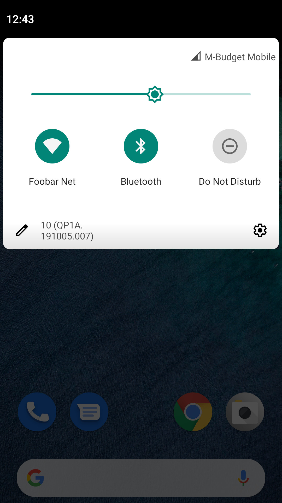

**3.** You go to WiFi settings.


**4.** You look at your MicroPython device, which you labelled with the name you gave it in the Python code above.


**5.** You plug in your device and see it appear as an open network in your WiFi settings.

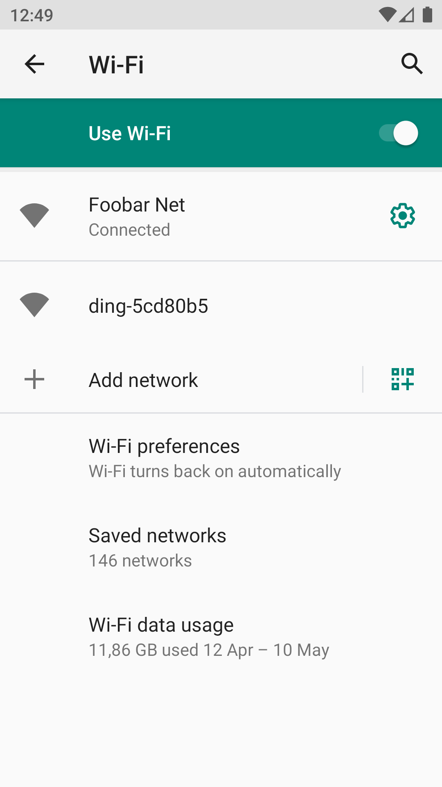

**6.** You select it and, like a network in a coffee shop or airport, you're told you have to login.

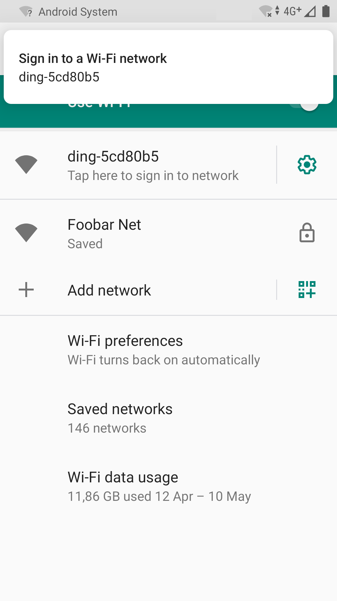

**7.** However, instead of a login screen, you're presented with a list of networks that your MicroPython device can see. You should select the network, i.e. _Foobar Net_, to which you want to connect your device.

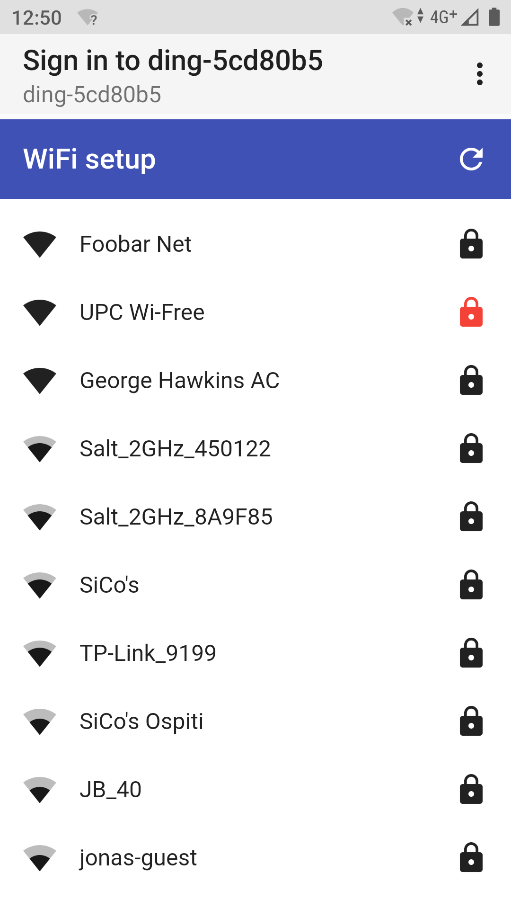

**8.** Once you select your network, you have to enter the network's WiFi password.

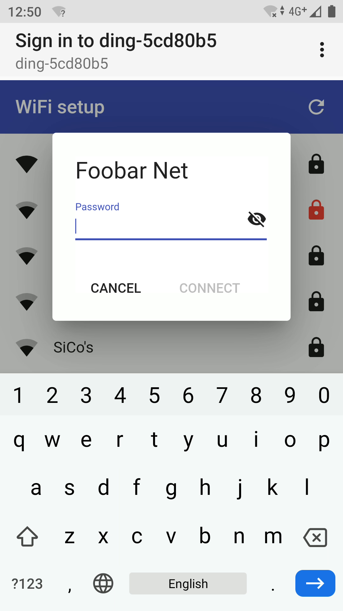

**9.** By default the password is hidden.


**10.** But you can click the visibility icon if you prefer the password to be visible as you type it.

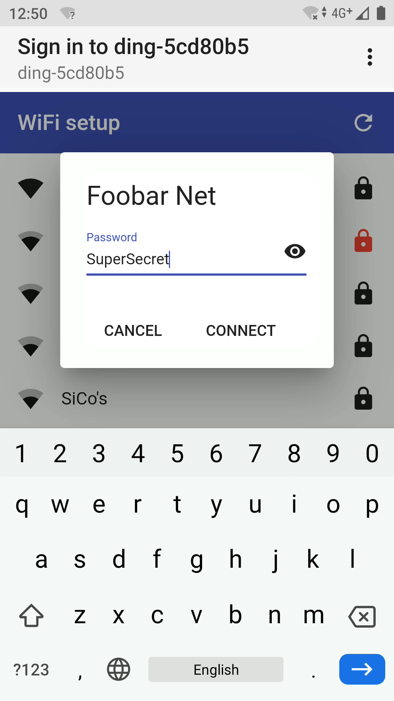

**11.** Once you click connect, it whirrs away for a while as your device attempts to connect to the network with the credentials you entered.


**12.** If all goes well, it tells you that it has connected and displays the IP address (or anything you want) that the device now has on that network. You press the copy icon, to hang onto the IP address, and click the OK button.

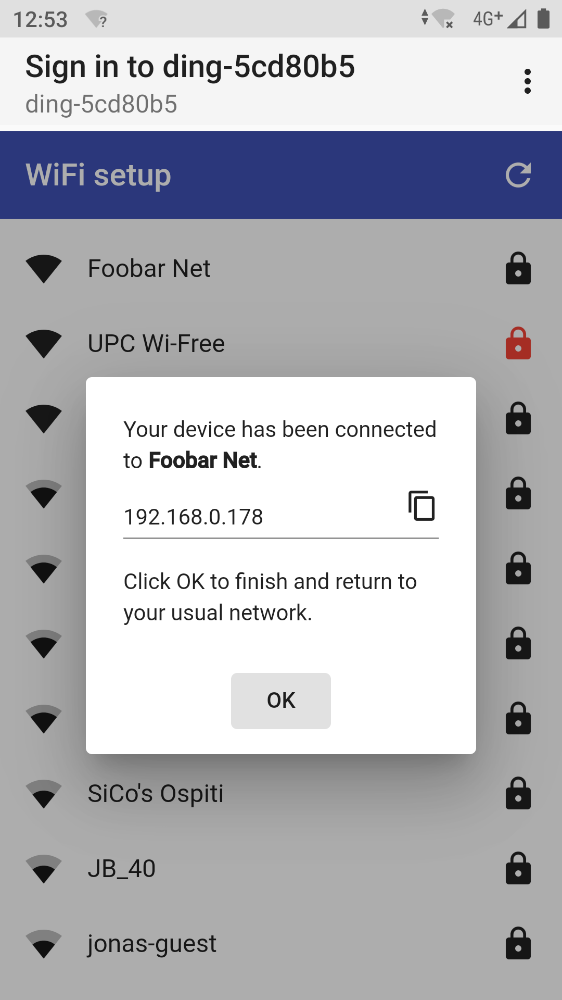

**13.** The device now shuts down the temporary WiFi network that was created for this setup process.

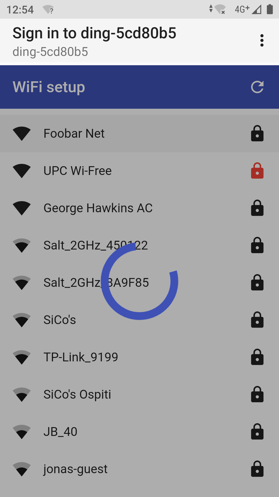

**14.** With the temporary network now gone, the usual behavior of your phone is to automatically return you to your previous network, i.e _Foobar Net_.

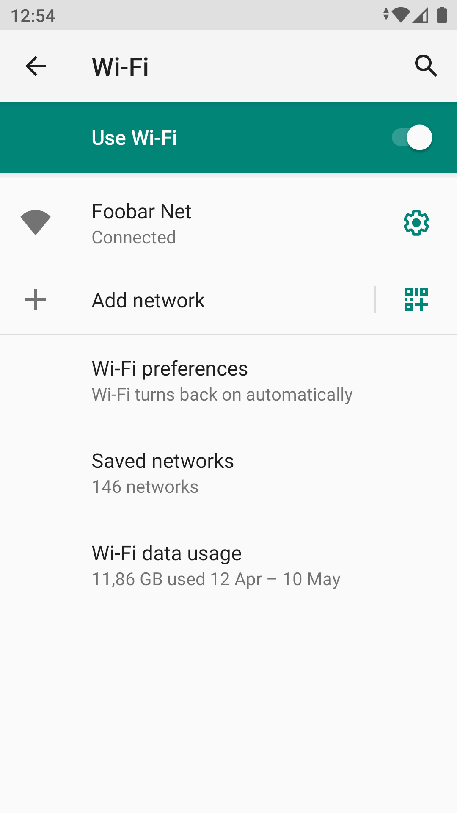

**15.** Now you return to your phone's main screen and select your web browser application, i.e. usually Chrome or Safari.

<!-- This image is a JPEG as otherwise the background makes it huge. -->
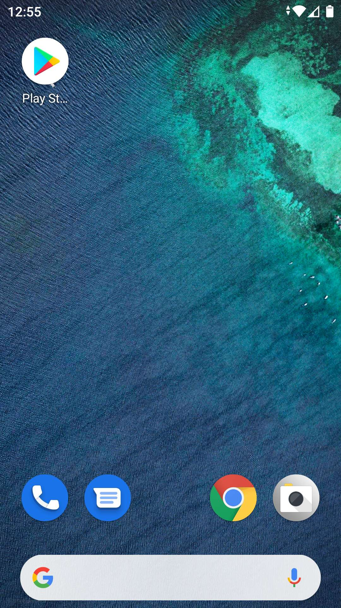

**16.** You paste the IP address that you copied earlier into the web address field.

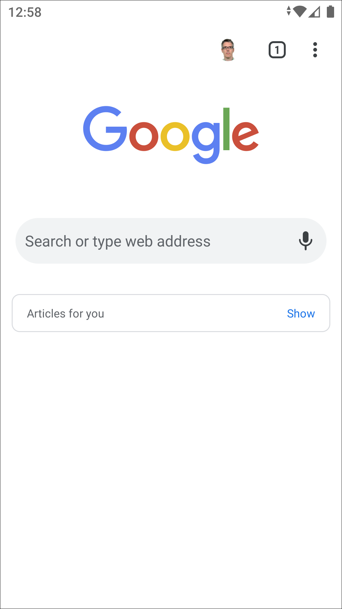

**17.** For the purposes of this demo, your MicroPython device just serves up a web page of a cute little ghost hovering up and down.

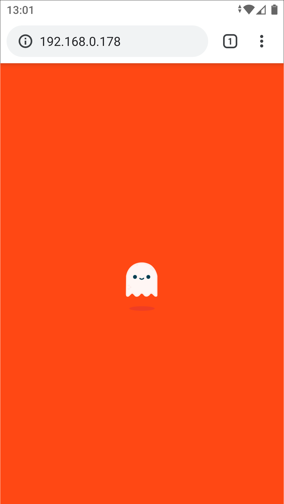

The entered credentials are stored on the device and the next time it is restarted it will reconnect to the network rather than starting the temporary WiFi network seen here for setup.

Notes
-----

No other device or service is involved other than your phone and your MicroPython device, i.e. your MicroPython device serves the web pages involved to your phone and manages the whole login process.

You may notice a red lock icon in some of the screenshots, this indicates that the network involved is using WPA2 Enterprise which is not currently supported.

By default the IP address of your device is displayed when it successfully connects to the chosen network however, you can configure the code involved to return whatever you want, e.g. an MQTT topic name.

The dialog that presents you with the IP address uses a kind of [dead man's switch](https://en.wikipedia.org/wiki/Dead_man%27s_switch) logic in the background that keeps the temporary WiFi network alive as long as it's showing. So the temporary WiFi network will shutdown if you explicitly close the dialog (by pressing OK) or if you e.g. simply manually switch back to your normal WiFi network.

The ghost is a tiny CSS demo by Helen V. Holmes and was found [here](https://codepen.io/scoooooooby/pen/pecdI).
